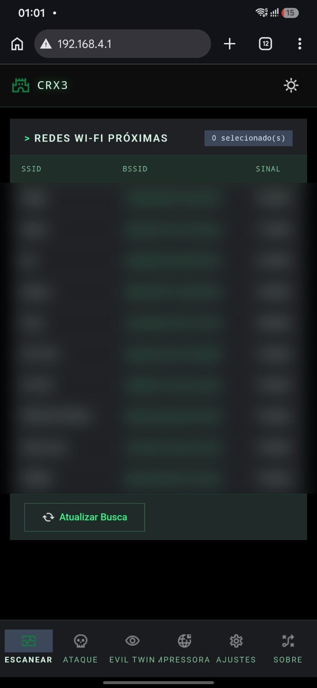
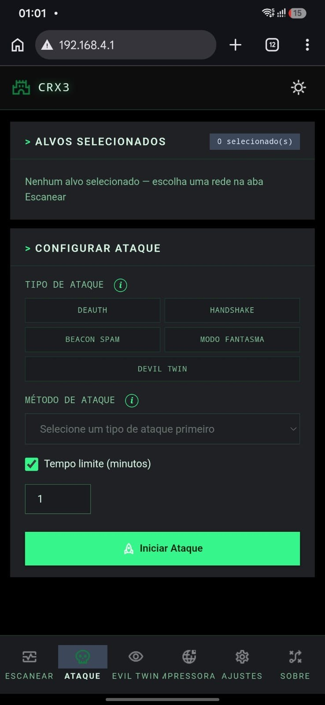
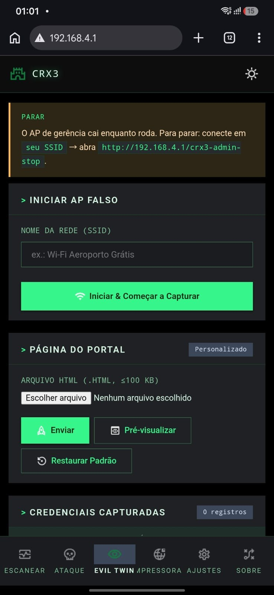
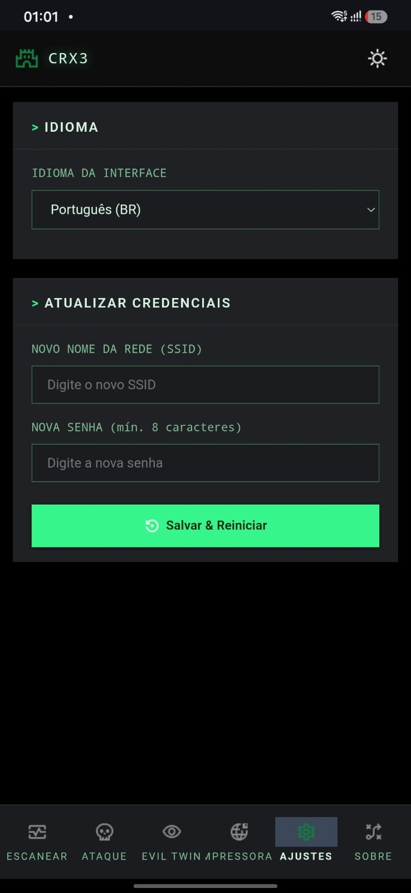
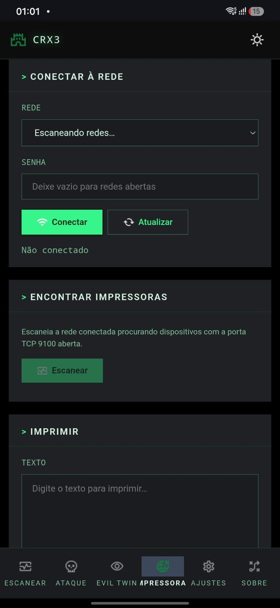

<div align="center">

**🇺🇸 English** | [🇧🇷 Português (Brasil)](README.pt-BR.md)


# CRX3

**A Wi-Fi security research firmware for the ESP32 — 100% open source, no strings attached.**

[](https://github.com/LuizFilipe89/ESP32-CRX3/stargazers)
[](https://github.com/LuizFilipe89/ESP32-CRX3/network/members)
[](https://github.com/LuizFilipe89/ESP32-CRX3/issues)
[](LICENSE)
[](https://github.com/LuizFilipe89/ESP32-CRX3/commits)
[](LICENSE)

</div>

---

**CRX3** turns a $5 ESP32 DevKit V1 into a full Wi-Fi penetration-testing toolkit, controlled entirely from a phone or laptop browser at `http://192.168.4.1` — no app to install. The web panel ships in **two languages: English (default) and Portuguese (Brazil)**, switchable anytime from Settings. It's a fork of [Sameer Al Sahab's Hydra-ESP / ProjectHydraOS](https://github.com/SameerAlSahab/ESP32-Deauther), which in turn is built on [risinek's](https://github.com/risinek/esp32-wifi-penetration-tool) original ESP32 Wi-Fi penetration tool.

This fork's focus: a fully **customizable Evil Twin** (your own SSID, your own captive-portal page), higher deauth/beacon-spam ceilings, and a round of real bug fixes to the attack-stop/timeout logic — all wrapped in a codebase kept as simple as possible to read, build, and extend.

> **Made with AI, in the open.** Every change in this fork was written by [LuizFilipe89](https://github.com/LuizFilipe89) working with Claude Sonnet (Anthropic) — with **no prior programming experience**. If you're learning too, the commit history is the whole story. See [Legal & Credits](#legal--credits) below.

---

<div align="center">

| Scan | Configure Attack |
|:---:|:---:|
|  |  |
| **Evil Twin** | **Settings — bilingual UI** |
|  |  |
| **Printer (in development)** | |
|  | |

</div>

---

## Table of Contents

- [Quick Feature Overview](#quick-feature-overview)
- [Hardware](#hardware)
- [Installation](#installation)
- [How It Works](#how-it-works)
- [Attacks](#attacks)
  - [Deauthentication](#-deauthentication)
  - [WPA Handshake Capture](#-wpa-handshake-capture)
  - [Beacon Spam](#-beacon-spam)
  - [Ghost Mode](#-ghost-mode-probe-request-spam)
  - [Evil Twin — fully customizable](#-evil-twin--fully-customizable)
  - [Deauth Attack Detector](#-deauth-attack-detector)
  - [Network Printer Attack (in development)](#-network-printer-attack-in-development)
- [Web Interface Tour](#web-interface-tour)
- [Default Credentials](#default-credentials)
- [Dependencies](#dependencies)
- [Legal & Credits](#legal--credits)

---

## Quick Feature Overview

| Feature | What it does | Limits |
|---|---|---|
| 🎯 Deauthentication | 4 methods, incl. one that beats 802.11w (PMF) | Up to 16 targets, intensity up to **50** frames/burst |
| 🤝 Handshake Capture | Captures WPA2 4-way handshake → `.pcap` / `.hccapx` | For Hashcat / aircrack-ng offline cracking |
| 📡 Beacon Spam | Floods the air with fake networks | Up to **250** fake SSIDs, 4 naming modes |
| 👻 Ghost Mode | Mirrors nearby devices' saved-network probes | No target needed |
| 🎭 Evil Twin | Clone a real AP **or** run your own custom SSID, with your own portal page | Fully customizable, credential log persists across reboots |
| 🚨 Deauth Detector | Passive monitor that flags deauth floods nearby | Real-time alert log |
| 🖨️ Network Printer Attack | Finds & prints to open network printers | 🚧 in development |

---

## Hardware

**Required**

- ESP32 DevKit V1, or any board using the same ESP32 (Xtensa LX6, dual-core) chip. Developed and tested on the standard 38-pin DevKit V1; **30-pin DevKit V1 boards work identically** — it's the same ESP32-WROOM-32 module on a narrower PCB with fewer GPIOs broken out, and this firmware doesn't need any of the pins that are missing. ESP32-WROOM-32 / WROVER modules on other board shapes are expected to work too. **ESP32-S2, S3, C3, C6, H2 and other variants are not supported** — different radio architecture, no raw packet injection.
- If you have an ESP32-S3 board, the upstream project has a dedicated branch: [`s3-N16R8`](https://github.com/SameerAlSahab/ESP32-Deauther/tree/s3-N16R8).

> **🛒 What to actually buy:** search for **"ESP32 DevKit V1"** or **"ESP32 DevKitC"** — a board built around the **ESP32-WROOM-32** module, with **at least 4 MB of flash** (the standard on every board sold today). **Either the 30-pin or 38-pin version works** — the pin count only changes how many GPIOs are broken out on the header, not the chip itself, and this firmware doesn't use the extra ones. Ignore any listing that says **S2, S3, C2, C3, C6, or H2** anywhere in the name — those are different chips this firmware doesn't support. The onboard USB-to-serial chip (CP2102 or CH340, doesn't matter which) only affects flashing from a PC; it has no effect on how the firmware runs, since control is 100% over Wi-Fi. Boards go for roughly $5–8 USD on AliExpress/Amazon.

**Optional**

- SSD1306 OLED display (128×64, I2C). Shows live attack timers, status, and captured Evil Twin passwords directly on the device. Auto-detected on boot — if it's not there, the firmware just skips it silently and the web UI still has 100% of the functionality.

---

## Installation

1. Grab the latest binaries from the **[Releases page](https://github.com/LuizFilipe89/ESP32-CRX3/releases)**, or build from source with ESP-IDF v5.3.2 (`idf.py build`).
2. Flash it:
   ```bash
   idf.py -p <PORT> flash
   ```
   …or with `esptool.py` directly:
   ```bash
   esptool.py --chip esp32 -p <PORT> -b 460800 write_flash \
     --flash_mode dio --flash_freq 80m --flash_size detect \
     0x1000   bootloader.bin \
     0x8000   partition-table.bin \
     0x10000  projecthydra-32.bin \
     0x190000 storage.bin
   ```
3. Power the board, connect to the `crx3` Wi-Fi network (see [Default Credentials](#default-credentials)), and open **`http://192.168.4.1`** in any browser.

---

## How It Works

On boot, the ESP32 raises its own Wi-Fi access point (the "management AP"). Connect a phone or laptop to it and open `http://192.168.4.1` — the whole control panel is served straight from the device's flash storage, no internet needed.

From there you scan nearby networks, tap one to select it as a target, pick an attack, configure it, and launch — all with live status and inline "what does this do?" explanations next to every option.

**One thing to know going in:** attacks that need exclusive use of the radio (Deauth, Evil Twin, Multi-Clone, Ghost Mode) temporarily shut down the management AP, so **you'll lose the web UI connection while the attack runs.** This is normal, not a crash — there's no live "stop" button once an attack like this is running, since the web UI itself is what goes down. A configurable timeout brings the AP back automatically; without one, a power cycle is what restores it (the custom-SSID Evil Twin mode is the one exception, with its own dedicated stop route — see below). Beacon Spam is the one exclusive-radio attack that does **not** take the management AP down — see below for why that's deliberate.

---

## Attacks

### 🎯 Deauthentication

Sends raw 802.11 deauthentication frames to disconnect clients from a target access point. Up to **16 simultaneous targets**, with intensity adjustable from 1 to **50 frames per burst** (**10** for Targeted Clients — see why below).

| Method | How it works | Best against |
|---|---|---|
| **Normal Deauth** | Classic broadcast deauth aimed at the whole AP | Most open/WPA2 networks |
| **BSSID Clone (Aggressive)** | Raises a rogue AP cloning the target's BSSID to confuse clients | Devices with 802.11w (Management Frame Protection), which ignore plain broadcast deauth |
| **Multi-Clone Deauth** | Rogue AP + a flood of space-padded SSID clones of the target | Overwhelming a network's visibility as well as connectivity |
| **Targeted Clients** | Sniffs which stations are actually connected, then deauths each one directly (with broadcast fallback) | Stubborn devices that shrug off broadcast deauth |

Targeted Clients caps intensity lower than the other methods (**10** vs **50**) because its frame count multiplies by however many clients it's found — a number that grows on its own as the attack runs, unlike the target count in the other methods, which you pick by hand. The same nominal intensity is a lot more frames/tick there than in broadcast mode.

---

### 🤝 WPA Handshake Capture

Nudges connected clients to re-authenticate (via deauth), then captures the resulting WPA2 4-way handshake — saved as **`.pcap`** and **`.hccapx`**, ready to drop straight into Hashcat or aircrack-ng for offline password auditing against a wordlist.

Methods: **BSSID Clone**, **Normal Deauth**, or **Silent Capture** (no deauth sent at all — just waits patiently for a natural handshake, stealthier but slower). Requires at least one connected client on the target network; runs until a handshake lands, the configured timeout elapses, or you power-cycle the device.

---

### 📡 Beacon Spam

Floods the local airwaves with fake 802.11 beacon frames — pollutes every nearby device's Wi-Fi scan list. Pick how many fake networks to broadcast, **up to 250**, and a naming style:

- **Common Names** — believable everyday SSIDs (`TP-Link_5G`, `Home-WiFi`…)
- **Random Strings** — pure noise
- **Rick Roll** — the SSIDs spell out the lyrics, one word per network
- **Security-themed** — alarming names for a bit of chaos ("FBI Surveillance Van", etc.)

Unlike every other radio-exclusive attack, this one **keeps the management AP running** instead of taking it down — deliberately. A phone connected to the AP is already anchored on its channel and picks up the flood passively, no active rescanning needed; an earlier version that hopped across all 13 channels (and had to drop the AP to free the radio for it) actually made real-world visibility worse, since the phone lost its connection and fell back to slower background scanning instead of just sitting there catching beacons. Sends are round-robin batched per configured network — calibrated the same way as Deauth's intensity ceiling — so the whole pool keeps cycling reliably even at the 250-network cap, with a self-monitoring safety check built in to catch (and warn about, via the serial log) any batch that starts eating too much of its time budget.

---

### 👻 Ghost Mode (Probe Request Spam)

Most phones and laptops constantly broadcast probe requests for every Wi-Fi network they've ever saved. Ghost Mode listens for those, extracts the SSIDs, and starts advertising those exact names back — so devices nearby try to auto-connect to your ESP32 instead of their real saved network. No target selection needed.

---

### 🎭 Evil Twin — fully customizable

This is the flagship attack, and the one this fork spent the most time on. There are **two ways to run it**, and both let you customize what the victim actually sees.

#### Mode 1 — Clone a real network

Pick a scanned AP as the target. CRX3 raises an **open (no password) clone** using the same SSID, while simultaneously deauthenticating the real AP so nearby clients disconnect. When they go looking for a network, they see the open clone, connect to it, and land on a captive portal asking for the Wi-Fi password.

- Every submission is checked against the **real** network before being accepted — wrong passwords are logged and the portal shows an error, correct ones are reported as captured.
- A safety timeout (5 minutes with no victim connecting) automatically calls off the attack and restores the management AP on its own — you're never permanently stuck waiting.
- There's no manual stop for this mode: like every attack that takes the management AP down, it ends on its own (password captured or the 5-minute timeout) or via a power cycle.

#### Mode 2 — Launch your own custom-name rogue AP

Don't want to clone anyone? Type in **any SSID you want** from the Devil Twin tab and launch a standalone open network. There's no real AP to deauth and no password to verify against — it just sits there, broadcasting your chosen name, logging every credential anyone submits to it, for as long as you want.

- Because this mode is meant to run indefinitely (collecting credentials over hours, say, at a public space you're authorized to test), it has **no automatic timeout**.
- **How to stop it:** since the management AP goes down while this runs, connect a device to your **own rogue AP** and open `http://192.168.4.1/crx3-admin-stop` — a dedicated admin route that's registered even while the fake network is up. This is the *only* attack in CRX3 with a way to stop it manually mid-run; every other attack ends via its timeout or a power cycle (see [How It Works](#how-it-works)).

#### Making it look real: custom captive portal pages

Both modes serve a captive-portal HTML page. From **Settings → Portal Page** you can:

- **Upload** your own HTML file (up to 100 KB) to replace the default portal — see **[docs/custom-captive-portal-guide.md](docs/custom-captive-portal-guide.md)** for exactly what the page needs to work (form field names, required endpoints).
- **Preview** the currently active portal before running an attack.
- **Restore** the factory-default portal at any time.

#### The credential log

Every submission — right or wrong, from either mode — is appended to a persistent log on the device (survives reboots), viewable and clearable from the **Devil Twin** tab: uptime, SSID, BSSID, username, password, and status at a glance.

---

### 🚨 Deauth Attack Detector

Flips the whole idea around: puts the ESP32 into passive promiscuous monitor mode and watches for *someone else's* deauth attack. Flags a BSSID once it sends more than 10 deauth frames in under a second — the textbook signature of an active attack — including broadcast deauths from a spoofed `00:00:00:00:00:00` source. Alerts show up in a live table in the web UI. Doesn't transmit anything; purely a monitor.

---

### 🖨️ Network Printer Attack (in development)

Joins a chosen Wi-Fi network as a station and scans the local subnet for printers on port 9100 (raw/JetDirect), 631 (IPP), or 515 (LPR) — not just 9100, since most consumer inkjets (Epson's included) never open a raw JetDirect port at all and only speak IPP. Printing tries raw PJL first and falls back to a minimal IPP `Print-Job` request (with a small hand-built PDF as the payload — the one document format IPP/AirPrint-class printers reliably accept, per the Printer Working Group's own client guide) when 9100 isn't open. The tab is present and wired up in the UI, but this feature is still being refined — expect rough edges if you try it.

---

## Web Interface Tour

Everything lives at `http://192.168.4.1`. The panel has **two languages: English (default) and Portuguese (Brazil)** — switch anytime from the Settings tab, no reboot needed.

| Tab | What's there |
|---|---|
| **Scan** | Nearby networks with SSID / BSSID / signal strength — tap a row to target it |
| **Attack** | Configure and launch any attack above, with live status, elapsed time, and results |
| **Devil Twin** | Evil Twin controls (both modes), custom portal upload/preview/restore, credential log |
| **Printer** | The in-development printer attack |
| **Detector** | Start/stop the deauth monitor, view the live alert log |
| **Settings** | Language switch, change the management AP's SSID/password (reboots to apply) |
| **About** | Firmware version, credits, legal notice |

---

## Default Credentials

| Field    | Default       |
|----------|---------------|
| SSID     | `crx3`        |
| Password | `notforfun`   |
| Web UI   | `192.168.4.1` |

Change these anytime from **Settings** — saved to NVS flash, so they survive reboots.

---

## Dependencies

| Library | License | Notes |
|---|---|---|
| [u8g2-hal-esp-idf](https://github.com/mkfrey/u8g2-hal-esp-idf) | See repo | Drives the optional OLED display |
| [u8g2](https://github.com/olikraus/u8g2) | BSD 2-Clause | Drives the optional OLED display |
| [esp-nimble-cpp](https://github.com/h2zero/esp-nimble-cpp) | Apache 2.0 | Vendored, currently unused — reserved for a possible future BLE module |
| [ESP32-BLE-Keyboard](https://github.com/T-vK/ESP32-BLE-Keyboard) | See repo | Vendored, currently unused — reserved for a possible future BLE module |

---

## Legal & Credits

**CRX3 is for educational purposes only.** Use it exclusively on networks and devices you own, or have explicit written authorization to test. Unauthorized use against networks that aren't yours is illegal in most jurisdictions — including under the Computer Fraud and Abuse Act (US), Computer Misuse Act (UK), and IT Act 2000 (India/Bangladesh), among others. **The authors — original and fork — accept no liability for misuse or any resulting damage. You are solely responsible for how you use this software.**

The full codebase, attack modules included, is **100% open source under GPL-3.0** — read it, learn from it, audit it.

| Role | Name |
|---|---|
| This fork (CRX3) | [LuizFilipe89](https://github.com/LuizFilipe89) — built with Claude Sonnet (Anthropic), no prior programming experience |
| Lead Developer, Hydra-ESP / ProjectHydraOS | [Sameer Al Sahab](https://github.com/SameerAlSahab) |
| Original Codebase | [risinek](https://github.com/risinek/esp32-wifi-penetration-tool) |
| Inspiration | [spacehuhn](https://github.com/SpacehuhnTech/esp8266_deauther) |
